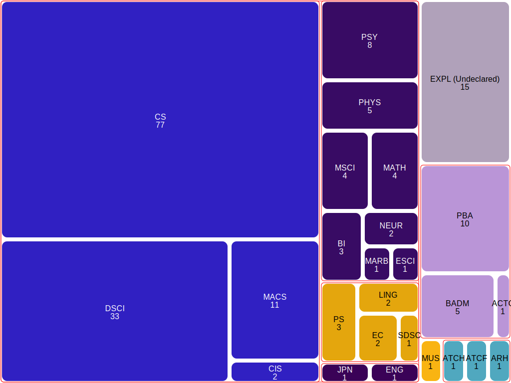

# Treemap

Treemap is a student project an introductory computer science course
(CS1 in the ACM curriculum model, CS 210 at U. Oregon, CS 161 at 
other Oregon public universities). This is a two part project that 
could be tackled in a single week or 
spread over two weeks, depending on how much facility students have 
acquired with writing and testing Python programs.  

## About treemaps

[Treemaps](https://en.wikipedia.org/wiki/Treemapping) were
introduced by [Schneiderman and Wattenberg in 2001](
https://dl.acm.org/doi/10.1145/102377.115768)
as a space-efficient display for hierarchical (tree-structured) data.
Tree-mapping requires an approach to _tiling_, the subject of the 
first part of the project, and to interpreting hierarchical structure 
in the data, the subject of the second part. 

## Learning objectives

- Recursive decomposition of collections as an algorithmic technique
    - Geometric interpretation (nested rectangles) of recursive 
      decomposition
- List indexing and slicing 
- Recursively structured data (nested dictionaries) 
  - including recursive type annotations in Python

Also 

- Software engineering
  - Incremental development, with automated testing
  - Factoring code into separate modules to break circular dependencies
  - Exchange formats (`json`) 

and Python goodies

- Naming disjunctive, and recursive types for type annotations
  - e.g., `Real = int | float`
- `isinstance` in a case breakdown on data type, including disjunctive 
  types
  - e.g., `if isinstance(v, Real): ...`

## How to complete this project

Clone or download this repository, then follow directions in
[The HOWTO document](docs/HOWTO-Treemap.md).
