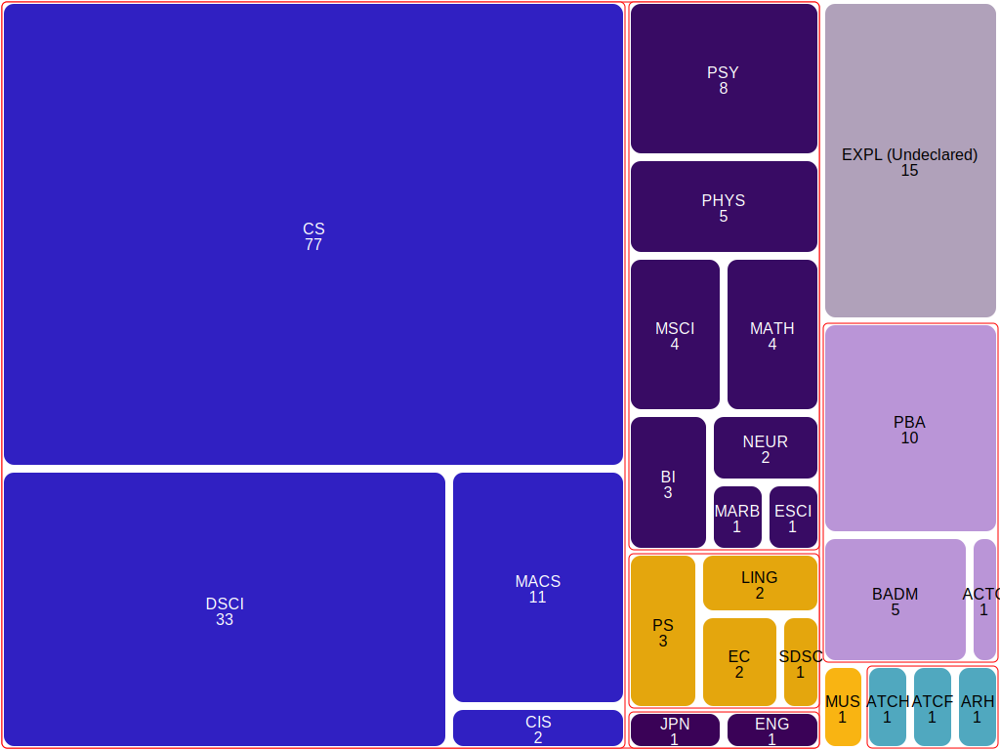

# Example data for treemapping

The contents of this directory are example data files for the 
treemapping project, all in JSON (Javascript Object Notation) format. 

## Flat lists of integers

- `small_flat.json` : This is the data set used for the small 
  illustration near the beginning of the project HOWTO document. 
  It is a single "flat" list of integers `[3, 9, 2, 4, 8]`.
  It should produce a diagram that looks like this (but with random 
  colors): 

  

- `medium_flat.json`  :  A slightly longer flat list of integers
   used in the HOWTO document to show why horizontal or alternating
   slices without balance ("squarifying") are unsatisfactory. It 
  should produce a diagram roughly like this, with varying colors: 

  

## Nested lists of integers

- `small_nested_list.json` : The smallest example of
  data organized as nested lists of integers. It is
  just two levels, `[3, [9, 2], 4, 8]`.

- `medium_nested_list.json` : A slightly larger example
  of data represented as nested lists of integers. 
  `[ [7, 9],
  20, 3,  14, 17, 25, 29, 3, 5, 13,
  [[2, 6], 12],
  [8, 5],
  20, 35 ]`. 

## Categorical data as nested dictionaries

- `attendance_cost.json`:  An alarming estimate of costs for a 
  resident (in-state) student attending a public university
  and living in campus housing (dorms), taken 
  from information published by the university in 2024. 
  `{
  "University Charges": {
  "Tuition": 15669,
  "Housing": 15840
  },
  "Books": 1320,
  "Personal": 2460,
  "Transportation": 432
}`

- `majors-23F.json`: Distribution of declared majors among students 
  in a CS-1 course at a public comprehensive university. 
  Much larger and busier than `attendeance_cost.json`. Labels are 
  major codes, which are more compact than names of majors but 
  probably meaningless to anyone outside that university.

- `ocean-biomass.json` : Adapted from figure 1 part A, 
[The Biomass Composition of the Oceans: A Blueprint of Our Blue Planet](
https://doi.org/10.1016/j.cell.2019.11.018)
Cell vol 179, issue 7, 12 Dec 2019, 1451-1454.  I have added 
  grouping into prokaryotes and eukaryotes.  The ratio between 
  plants and animals is surprising (shouldn't there be more plants 
  than animals consuming plants?), but the published article shows 
  four times as much biomass of animals.  And as much mass of 
  protists as of animals ... weird! 

>"We further observe that in the
> marine environment, animals, protists, and bacteria together account
> for ≈80% of total marine biomass, whereas on land, they represent a
> mere ≈2% of the total biomass (Bar-On et al., 2018)."

The authors explain: 

> At first glance, this result might seem paradoxical. How can a small
> mass of producers sustain a larger biomass of consumers? The answer
> lies in the relative turnover rate of producer and consumer biomass.
> In the ocean, producer turnover occurs over fast timescales of days,
> whereas larger consumers like fish or crustaceans have much longer
> turnover times, on the order of months to years (Sheldon et al.,
> 1972). The flux of energy, which is proportional to biomass and
> inversely proportional to turnover time, is still higher in producers
> than in consumers as dictated by the conservation of energy. That is,
> even though producer biomass is small, it turns over much more
> rapidly, and thus producer productivity is higher than consumer
> productivity.

The Cell article uses a Voronoi treemap diagram. It is interesting to 
compare this to a conventional "squarified" treemap produced by this 
project. 

This data also suggests that an additional non-categorical grouping 
option would be useful for data legibility, as grouping animals with 
protists (despite having no natural category) would make it easier to
see that they are the same size.  You can test this by adding a 
meaningless category (nested dictionary) that groups them.  