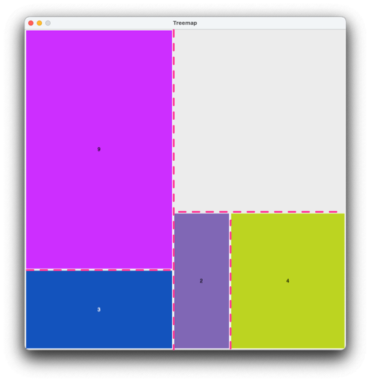
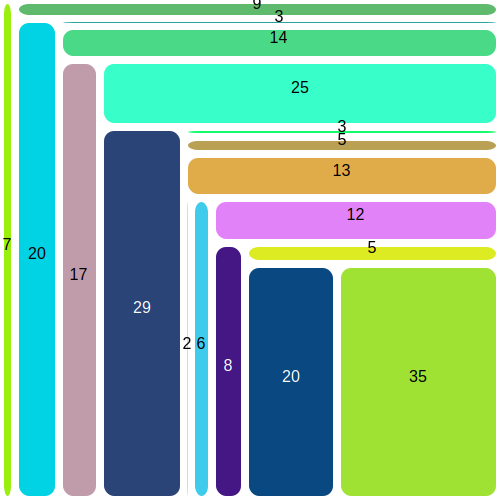
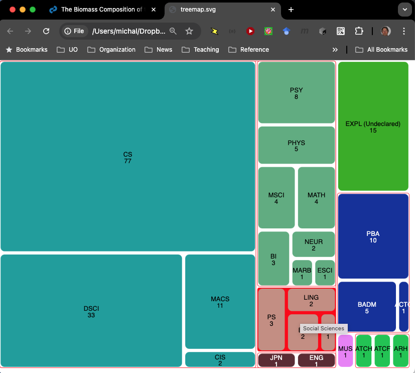

# HOWTO build a treemap

A [_treemap_](https://en.wikipedia.org/wiki/Treemapping)
is a diagram that represents a collection of values by 
proportionally-sized tiles.  Tiles may also be grouped
to indicate hierarchical structure.  We will focus 
initially on _tiling_ in part 1, then turn attention to _grouping_
in part 2 of this project. 

> [!TIP]
> Treemaps are a visual presentation. Part 1 of this project 
> does not depend on vision.  Instructors 
> should offer an alternative to visually impaired students for 
> part 2. I suggest constructing an HTML
> list structure with the "tree view pattern" in place of the
> graphical depiction.   [Further construction notes TBD.]

# Part 1: Tiling 

## Divide and conquer

There are many variations on treemapping, but all are fundamentally 
built on recursively subdividing a collection of values while also 
subdividing the space to be tiled. For example, given the values
`[3, 9, 2, 4, 8]`, we might produce the diagram 

![Treemap of \[3, 9, 2, 4, 8\].
Each integer is represented by a rectangle of
corresponding size: 3 above 9, then 2 and 4 above 8.
](img/step-4.svg)

The layout corresponds to a 
_tree_ of values. 


In the tree diagram, we can see the values to be tiled as leaves of 
the tree (represented as rectangles) with the individual values 3, 9,
2, 4, and 8.  Groups of nodes (which will be represented by groups 
of tiles) are represented by circles containing sums of tiles in 
each group.   Values 3 and 9 are grouped under a node 12 (3 + 9), 
2 and 4 grouped under 6, and 8 with the subgroup of 2 and 4 with
sum 14.  Finally, at the root of the tree, the value 26 represents 
subgroups with sums 12 and 14, which together include all the
values. The tile or group of tiles represented by each node is 
drawn in a size proportional to the value in the tree node 
representing that tile or group.  


### Squarer is better

There are many ways we could divide a rectangle into tiles.  For 
example, we could simply slice it up either vertically or 
horizontally. 


If we always slice the same way, we get long skinny tiles.  With a 
larger number of tiles, this becomes less and less useful. 


Slicing either horizontally or vertically can provide an aspect 
ratio (ratio of height to width) closer to 1.0, but is still not good. 


To do better, we need to divide the list of values into
better subgroups.  To "squarify" the tiles, we can repeatedly
subdivide the collection of values into groups that are as close as 
possible to equal in total. 


### Balanced splits

We will produce more "squarified" treemaps by dividing each 
list of values at a point that minimizes the difference between the 
sum of the two parts.   This will not always be the middle of the 
list.  For example, suppose we want to divide the list
`[1, 1, 1, 1, 1, 5]` into two parts.  If we divided into `[1, 1, 1]`
and `[1, 1, 5]`, the sums would be 3 and 7.  Dividing into
`[1, 1, 1, 1, 1]` and `[5]` gives more balanced sums of 5 and 5.

### Example

Consider laying out a tiled diagram for `[3, 9, 2, 4, 8]` in a
square canvas, 750 by 750 units.  

_Note: This illustration uses a Cartesian coordinate system the 
origin (0,0) in the lower left corner.  Our graphics will actually 
use a coordinate system that is vertically flipped, with the origin 
(0,0) in the top left corner._

The sum of values in `[3, 9, 2, 4, 8]` is 26, so we would like to 
divide it as close to possible to 13 + 13.  An exact split is not 
possible, but we can divide it into `[3, 9]` and
`[2, 4, 8]` (12 + 14).   We can make a corresponding division of the 
750 by 750 unit canvas into 346 by 750 (12/26 of the original 750 
unit width) and 
404 by 750 (14/26 of the original).  We will tile `[3, 9]` in the 
former and `[2, 4, 8]` in the latter. 

To lay out tiles for `[3, 9]` in the smaller of the two parts of the 
canvas, we again bisect it, in the only way possible as `[3]` and 
`[9]`.  The 346 by 750 region of the canvas is divided proportionally,
producing a 346 by 187 rectangle for `[3]`


Similarly, `[9]` is placed in a 346 by 563 rectangle in the remaining 
part of the 346 by 750 region. 


It remains to lay out `[2, 4, 8]` in the right side of the canvas.  
We bisect `[2, 4, 8]` into `[2, 4]` and `[8]`, (totals 6 and 8) and 
make a corresponding division of the canvas region.  `[2, 4]` is 
then bisected into `[2]` and `[4]`, again making corresponding 
divisions of the canvas region.  (Regions are split vertically if 
they are taller than they are wide, and horizontally otherwise.)



This leaves just `[8]`, which is placed in the remaining portion of 
the canvas. 


### Getting a start

First make sure you really understand the concept of dividing a 
list of values while making corresponding subdivisions of
a rectangular area.  Re-read the section above, more than once if 
you need to.  This is a general rule of program design:  You 
_must_ have a clear conceptual design before you start 
writing code.  That doesn't mean that you have worked out every 
detail of the design.  In most cases you will revise the design of 
your code multiple times as the consequences of your design 
decisions become apparent.  But you must have a clear concept of 
your solution strategy before you begin. Otherwise, your
muddy concept will mire your code so badly that you must abandon
it and start over.

In what follows, I have provided some code that manipulates 
rectangles and their display on screen. It will be up to you to 
decompose a list of values and direct the corresponding 
decomposition of a rectangular canvas.  

### Starting files

I have provided a `treemap.py` main program.  It imports `mapper`,
which you should create by copying or renaming
`mapper-skel.py` to `mapper.py`.   

Your additions will be in `mapper.py`.   Let's begin by reviewing
the starter code. 

#### Logging 

After the header comment, which you should fill in, `mapper.py` 
imports the `logging` module.  This module is initialized with 

```python
logging.basicConfig()
log = logging.getLogger(__name__)  
log.setLevel(logging.DEBUG)   
```

This 
lets you write "log" messages in your code to help with debugging.  
Log messages are similar to print statements, but they have two 
important advantages.   First, you can suppress their output by 
changing the log "level".  Initially we have configured the logging 
package to print anything in a `log.debug("your message here")` 
statement.   Later, when you have successfully debugged this module, 
you don't have to remove or "comment out" those statements.  You can 
just change the level with `log.setLevel(logging.INFO)` to suppress
output from calls to`log.debug()`.  The second advantage of logging
is that the printed output comes with some extra identifying 
information.  For example, here is some log output from my 
implementation: 

```text
DEBUG:mapper:[1]|[2, 1]
DEBUG:mapper:(Exclude item at split)
```

Initially this may not seem like much of an advantage.  Why would 
you need to know that the log message came from `mapper.py`?  As 
you progress farther in programming, building programs composed of 
many source code files working together, the identifying information 
becomes essential. 

We also import that `doctest` module, which allows us to include 
test cases in function docstrings.  We will make use of that shortly.
Because it becomes unwieldy to include more than a few test cases in 
docstrings, I have also provided some separate test modules 
including `test_splitter.py`. 

Next we see imports of two modules that I have provided for this 
project.

#### Geometry

I have provided a module `geometry.py` with `Point` and `Rect` 
(rectangle) classes.  A rectangle is defined by its lower left and 
upper right corners, in integer coordinates.  

_Note: Most graphics systems use a vertically flipped 
coordinate system, with (0,0) in the upper left corner.
The lower left corner and upper right corner of a `Rect` will
actually appear in the _upper_ left and _lower_ right in the 
display.  The vertical flip does not affect our program logic._

`Rect` provides a method `split` that returns two sub-rectangles
in some proportion. For example, suppose we have decomposed
`items = [2, 4, 3, 3]` into `left = [2, 4]` and `right = [3, 3]`.
To divide a rectangular region into subregions proportional to the
parts of the list, we could write

```python
    proportion = sum(left) / sum(items)
    left_rect, right_rect = rect.split(proportion)
```

Suppose the original `rect` has area 10.  This code would divide it 
into a rectangle `left_rect` with area 6, corresponding to the sum
the list `left`, and a rectangle `right_rect`, corresponding to the 
sum of list `right` (the remainder of the original list `items`). 

#### Describing a _disjunctive_ type

We can build treemaps using integers or floating point numbers, or 
even a mix of the two.  How can we write type annotations for 
functions that can take a list of `float`, a list of `int`, or a 
list that mixes the two?  Python allows us to create a new type that 
is the _disjunction_ ("or")  of `float` and `int`.  

```python
Real = int | float   
```
We pronounce the vertical bar "or", and I would pronounce the 
statement as "a Real is an int or a float".   We use this 
disjunctive type `Real` in the header for the `treemap` function:

```python
def treemap(values: list[Real], width: int, height: int):
    """Create treemap of values in width x height pixel display
    in Tk interface and in SVG file written to treemap.svg.
    """
```

#### `treemap` and `layout`

The main work of laying out the tree map display is in function 
`layout`.  The provided version of `layout` uses a simple loop, but 
soon you will create a recursive version that passes a `rect` 
(rectangular region) argument.  The `treemap` function starts it 
with the whole list of values to be displayed and the whole display 
area as the rectangular region to display them in. 

This initial version of `layout` should already "work" in the sense 
that it will draw a rectangle for each value in the input list, but 
the simple loop produces a very poor layout. To do better, we need 
to recursively divide lists into approximately balanced sublists. 

### Dividing into balanced sublists

You will need to write a function that 
takes a list of two or more positive numbers and returns two sublists
which together comprise the original list.   Add the header of the 
`bisect` function, including 
test cases, with a dummy body. 

```python
def bisect(li: list[Real]) -> tuple[list[Real], list[Real]]:
    """Returns (prefix, suffix) such that prefix+suffix == nest
    and abs(sum(prefix) - sum(suffix)) is minimal.
    Breaks tie in favor of earlier split, e.g., bisect([1,5,1]) == ([1], [5, 1]).
    Requires len(nest) >= 2, and all elements of nest positive.

    >>> bisect([1, 1, 2])  # Perfect balance
    ([1, 1], [2])
    >>> bisect([1.5, 1.5, 3.0])  # Similar, works with floats
    ([1.5, 1.5], [3.0])
    >>> bisect([2.0, 1, 1.0])  # Perfect balance, mixed
    ([2.0], [1, 1.0])
    >>> bisect([1, 2, 1])  # Equally bad either way; split before pivot
    ([1], [2, 1])
    >>> bisect([6, 5, 4, 3, 2, 1])  # Must include element at split
    ([6, 5], [4, 3, 2, 1])
    >>> bisect([1, 2, 3, 4, 5])
    ([1, 2, 3], [4, 5])
    """
    assert len(li) >= 2, f"Cannot bisect {li}; length must be at least 2"
    log.debug(f"Bisecting {li}")
    return ([], [])  # FIXME:  Replace this with implementation
```

There are several things to notice about this function header: 
- It specifies that `bisect` takes one argument, which should be
  a list of numbers (`int`, `float`, or a mix).  The Python interpreter 
  will not check this,
  unfortunately, but you may be using other tools such as 
  an interactive development environment (IDE)
  like VS Code or PyCharm that provides type annotation checking.
- It specifies that `bisect` will return _two_ lists in a
  tuple.  This is a handy feature of Python ... we can write
  `return a, b` to return the values of `a` and `b` together in a 
  tuple. 
- The type annotations do not specify that the input list must
  have at least two elements, and that all of them must be
  _positive_ numbers, or that the result should be two parts of the
  original list in the same order, with balanced sums.  Type 
  annotations are not powerful enough to specify these _semantic_ 
  properties, so they are instead stated succinctly in the docstring 
  comment.  "_Succinctly_" is not incidental here:  The docstring 
  should serve as quick reference documentation for another 
  programmer who wants to reuse your code.
- Following the main docstring, we have included a set of 
  _doctest_ test cases to check our implementation.  Passing
  these test cases will not guarantee that your implementation
  is correct; no finite set of test cases can do that.  They will,
  however, catch many simple and common bugs.
- The first statement in the body of the function is an
  `assert` statement that checks to be sure `bisect` has been
  called with a list of at least two elements.  It does not
  check all the required properties of `li`, which would require
  more elaborate code, but it is a little bit of _defensive 
  programming_ to make debugging easier. 
- We initially write a dummy body (always returning `([], []))` 
  regardless of the input argument) so that we can start testing
  even _before_ we have written the real function body. 

### Checkpoint

At this point you should check to your work.  We don't expect our 
test cases to succeed.  In fact they should all fail. We just want 
to ascertain that we haven't made any fatal typos or syntax errors. 
You should run `splitter.py`, and expect to see output that looks 
like this: 

```doctest
DEBUG:__main__:Bisecting [1, 1, 2]
**********************************************************************
File "/Users/michal/Dropbox/23F-210/projects/Treemap/splitter.py", line 20, in __main__.bisect
Failed example:
    bisect([1, 1, 2])  # Perfect balance
Expected:
    ([1, 1], [2])
Got:
    ([], [])
... lots more like that 
**********************************************************************
1 items had failures:
   6 of   6 in __main__.bisect
***Test Failed*** 6 failures.
```

That's fine! It's what we expected!  

On the other hand, if your output looks like this:
```doctest
   File "/your/path/here/Treemap/mapper.py", line 32
    def bisect(li: list[Real]) -> tuple[list[Real, list[Real]]:
                                       ^
SyntaxError: '[' was never closed
```
or like this: 
```doctest
Error
**********************************************************************
File "/Your/file/path/here", line 20, in splitter.bisect
Failed example:
    bisect([1, 1, 2])  # Perfect balance
Exception raised:
    Traceback (most recent call last):
      ... more stuff here
      File "/Your/file/path/here", line 34, in bisect
        retrun ([], [])  # FIXME:  Replace this with implementation
    NameError: name 'retrun' is not defined
```
 
then you have an error that is best to repair now, before you start 
work writing your bisection code. 

When you have only test _failures_ and no more test _errors_, we can 
move on to the next step. 

### Finding our balance

How can we divide a list of positive numbers in a balanced way, 
considering the _sums_ of the two parts rather than their _length_?
We can find the smallest index _i_ such that `sum(li[:i+1])` is 
greater than half the sum of the whole list `li`.  

Consider if `li` is  `[1, 2, 3, 4, 5, 6]`, which has sum 21. 
The _i_ we seek would be 4, because `li[:4]` is `[1, 2, 3, 4]`, with 
sum 10, a little less than half of 21, and `li[:5]`, which is
`[1, 2, 3, 4, 5]`, sums to 15.   

Can we be sure that such an _i_ will always exist?
Provided all the 
elements of `li` are positive and `len(li) > 1`, we can be sure 
that `sum(li) > sum(li)/2`.  Since `li[:len(li)+1]` is the same as 
`li`, we know that there is some _i_ in `range(len(i))`
such that `sum(li[:i+1])` is 
greater than half the sum of the whole list.  We just need to find
the _smallest_ such _i_, which we can do by looping through the 
indexes of `li`. 

Our first cut at the bisection algorithm might apply this property 
directly: 

```python
    for i in range(len(li)):
        if sum(li[:i+1]) > sum(li) / 2:
            break
    return li[:i], li[i:]
```

This solution uses notation like `li[:i]` to denote the _slice_ of 
the list from `li[0]` up to but not including `li[i]`, and `li[i:]` 
to denote  the slice starting at `li[i]` and including the rest of 
the list.  If you are not familiar with slices, try a few examples 
in the Python console: 

```pycon
PyDev console: starting.
>>> my_list = [1, 2, 3]
>>> my_list[1:]
[2, 3]
>>> my_list[:1]
[1]
>>> my_list[3:]
[]
>>> my_list[1:3]
[2, 3]
```

When we execute our program, some of our doctests will succeed, but 
some will fail: 

```pycon
Failed example:
    bisect([6, 5, 4, 3, 2, 1])  # Must include element at split
Expected:
    ([6, 5], [4, 3, 2, 1])
Got:
    ([6], [5, 4, 3, 2, 1])
```

In this example, splitting into a part that sums to 11 and 
another that sums to 10 is better than splitting into 6 and 15.  It 
appears that we must add a check in our function to determine 
whether `li[i]` should be included or excluded from the first part.

![[6, 5] is closer to the ideal 10.5 than [6]](
img/split-include-break.svg)

We can make the needed adjustment with a few lines of code.  There 
are two possibilities.  We could split `li` into `li[:i]` and 
`li[i:]` (excluding `li[i]` from the first part and including it in 
the second), or we could split into `li[:i+1]` and `li[i+1:]`, 
placing item `i` in the first part.  We want the first part to come 
as close to half the sum of `li` as possible, which we can determine
by subtracting each sum from `sum(li)/2` and comparing the absolute 
value of the differences.   

I leave the design of a test to include or exclude `li[i]` to you.  
Making it simple and readable is a challenge.  After first plugging 
over-complicated (and incorrect) code directly into `bisect`, I 
found the following tactics useful to simplify it and get it right: 
- Begin by computing a _target_ sum, which is half the sum of the 
  whole list.  The closer the first part of the split is to this 
  target, the better.  This is simpler than checking the difference 
  between the sum of the first part and the sum of the second part. 
- Simplify the code in `bisect` by factoring out the part that 
  determines how far a possible split is from the target.  I made a 
  function `badness` that computed the absolute value of the 
  difference between a target value and the sum of elements in a list. 

The body of my `badness` function is only one line of code, but 
using it was enough to make my `bisect` code transparent and to get 
it right. 

### Too slow! 

There is another problem with our first solution: Although `sum` is a 
built-in Python function, internally it is a 
loop that works as if you had written 

```python
def sum(li: list[int]) -> int: 
    total = 0
    for i in range(len(li)):
        total = total + li[i]
    return total
```

> [TIP]
> When we reason about efficiency, we need to consider
> not just loops in our own code, but 
> also "invisible loops" in functions and operations we use.  
> Usually we can count on library functions and operations to use 
> efficient algorithms, so we reason about what they _must_ do to 
> accomplish their function.  For example, we know that `sum` _must_ 
> access each element of a list, so it must take _at least_ time 
> proportional to the length of the list. 

Consider that this `sum` function is called each time through the 
loop in our `bisect` function.  How many times is the statement 
`total = total + li[i]` executed?

Suppose the `li` is `[1, 1, 1, 1, 10]`, which is the worst case in 
which our loop sums each slice up to the last.  To simplify our 
reasoning, we'll consider only the call to `sum(li)`, which sums the 
whole list each time.  Since our loop will execute 5 times (once for 
each item in the list), and we will loop through the whole list to 
sum it each time, this will be 25 additions.  That doesn't sound bad,
but now imagine our list has 100 elements. 100 times 100 is 10,000.  
A list of 1000 elements will perform 1,000,000 additions, and so on: 
The number of operations is growing proportionally to the _square_ 
of the length of the list.  This is called a _quadratic_ growth 
pattern, which is something we'd like to avoid if we can. 

We do not have a doctest to determine whether our implementation of 
`bisect` is fast enough, but I have included such a test case in a 
separate testing script, `test_splitter.py`.  The speed test times 
bisection of a list of 50,001 integers.  It checks to be sure the 
function executes in less than a second.  Try it: 

```commandline
python3 test_splitter.py
```

On my vintage 2020 M1 
Macbook Pro, our first implementation fails the speed test with 
messages that look something like this: 

```pycon
DEBUG:test_splitter:Splitting 50001 items in 20.64364004135132 seconds
Ran 9 tests in 20.648s
FAILED (failures=1)

Failure
Traceback (most recent call last):
  File "/your/path/test_splitter.py", line 78, in test_fast_enough
    self.assertLess(elapsed, 1.0)
AssertionError: 20.64364004135132 not less than 1.0
```

### Faster! 

We can do much better by calculating a list of _partial sums_.
Consider the list `[1, 2, 3, 4, 5]`; the corresponding list of 
partial sums is `[1, 3, 6, 10, 15]`, i.e., `partials[i]` is equal to 
`sum(li[:i+1])`.  The trick is that we don't need to call the `sum` 
function for each element `i`.  Instead, we can keep a running total.
For example, the partial sum at index 3 is the partial sum at index 
2 plus the item at index 3. 

|  list    | i=0 | i=1 | i=2| i=3| i=4 |
|----------|-----|-----|----|----|-----|
| li:      |   1 |  2  |  3 |  4 |  5  |
|partials: |   1 |  3  |  6 | 10 | 15  |

We can create this list in one "pass", looping through `li` while 
keeping a running total and appending the running total to a new 
list `partials`.   

After we have created the list `partials`, we can make one more loop 
(after the first loop, not inside it) to find the element `i` at 
at the balance point 
where `partials[i]` is first greater than `sum(li) // 2`.  Don't 
call `sum(li) // 2` each time through the loop! Compute it just once, 
_before_ the loop, store it in a variable, and use it over and over in 
the loop.  

You already have `sum(li)` as the last of the partial sums you 
calculated above, so you can reuse that.  

When you have replaced the _quadratic time_ algorithm that
called `sum(li)` each time through the loop
each time through the loop with a _linear time_ algorithm that
just checks the precomputed partial sum at each position, your 
code will run much faster on long lists.  The timing test case in
`test_splitter.py` should now bisect a list of 50,001 items in
a fraction of a second: 

```pycon
Launching unittests with arguments python -m unittest /your_path/test_splitter.py  
DEBUG:test_splitter:Splitting 50001 items in 0.009398937225341797 seconds
Ran 11 tests in 0.012s
OK
```

### Checkpoint: Summary of your work so far

So far you have created a function `bisect` in a new file
`splitter.py`.  This function takes a list of at least two
positive numbers.  It returns _two_ results as a tuple.
The first result and the second result together comprise the input 
list, and their sum is as close as possible to equal. 
You have created a 
linear time algorithm that first
creates a list of partial sums, then in a separate loop finds the 
index of the first element of the partial sum that is greater than 
the sum of all the elements of the list being bisected.  Finally it 
chooses to include that element in the first part or not.  

All the doctests in `splitter.py` should now pass when you execute 
`splitter.py` by itself.  The test cases in `test_splitter.py` 
include those and a few more, including a speed test.  All the test 
cases in `test_splitter.py` should also pass. 

### Laying tile

Now that we can split a list of positive integers into two balanced 
parts, let's use it over and over to tile a rectangular area.  

```commandline
> python3 treemap.py data/medium_flat.json 500 500
```
You should see a tiling that is dominated by skinny rectangles: 



This diagram is drawn as the program runs and also saved in SVG 
format as `treemap.svg`.   Colors may vary as they are generated 
randomly.  If you run the same program again, you will see a 
different selection of colors. Click the graphics window to close it. 

While the `geometry` module always splits a rectangle in the 
narrower dimension, we nonetheless get a very poor layout because of 
the way the `layout` function loops through the list of values, 
simply drawing one rectangle after another. 

```python
def layout(items: list[int], rect: geometry.Rect):
    """Lay elements of nest out in rectangle.
    Version 0 (skeleton code) just takes a slice off the canvas for
    each rectangle.  You will replace it with much better recursive
    layouts.
    """
    while len(items) > 0:
        log.debug(f"Laying out {items} in {rect}")
        proportion = items[0] / sum(items)
        left_rect, rect = rect.split(proportion)
        label = str(items[0])
        display.draw_tile(left_rect, label)
        items = items[1:]
```

Splitting the list into balanced parts, using the `bisect` function 
you just completed, can provide a much better layout.  We'll want to 
divide the rectangular area into two parts proportional to the sums 
of the lists returned by `bisect`, similar to the proportional 
splitting in the skeleton code.  Then we'll need to lay out each of 
the two lists. Since we may need to split each of those lists again, 
a simple loop will not suffice.   The problem is inherently 
_recursive_. 

In any recursive algorithm, we must identify one or more base cases 
and one or more recursive cases.  The base case for recursive tiling 
of a list of integer values is simple:  If the list contains a 
single value, it takes the whole rectangle:
```python
    display.draw(rect, items[0])
```

The recursive case uses the `bisect` function: 
```python
  left, right = bisect(items)
```

Here I am calling the parts "left" and "right", but they might be 
layed out either horizontally or vertically, depending on the choice 
made by `rect.split`.  

In the recursive case we will make _two_ recursive calls:  One to tile 
the sub-list `left` in one part of the provided rectangle, and one 
more to tile the sub-list `right`. 

That is enough information to write a recursive version of `layout`. 
Do that now, and the same command above should produce a much
nicer-looking treemap: 


### Checkpoint

This concludes part 1 of the project.  You should now have a 
function `bisect` in `splitter.py` and a function `layout` in 
`mapper.py` that together produce treemaps like the illustration 
above from lists of integers in JSON files like
`data/medium_flat.json`.   This might be a good time for a 
little rest, a cup of tea or coffee, a refreshing walk, or
tackling some reading for another class.  If you spent more than an 
hour on part 1, and assuming you started the project early in the 
week, consider tackling part 2 tomorrow. 

Part 2 will consider richer data sources with hierarchical structure 
that we wish to preserve in the treemap. 

## Part 2: Hierarchically structured data

The power of treemaps as a data visualization technique is in 
presenting data that already has a hierarchical structure.  Humans 
are not good at visually comparing sizes of more than a very small 
number of rectangles.  Consider the two rectangles labeled '3' in 
the last example above.  Can you see that they are the same size? 
It is more likely that you can discern at a glance that the 
rectangle labeled 9 and that labeled 7 in the first column are 
together still a little less than the adjacent rectangle labeled 20. 
If our data has a natural hierarchical structure, and if that 
structure is preserved in the treemap representation, then  a treemap 
can help us see relationships within a small group, and between larger 
groups, not so much between parts of different large groups.

We will proceed in two steps.  First we will add the ability to deal 
with _nested_ lists of integers like `[3, [9, 2], 4, 8]`.  We say 
the list `[9, 2]` is _nested_ within the outer list.  We will ensure 
that `[9, 2]` is a rectangular group within the treemap depiction, 
so that it is easy to visually compare the sizes of those elements. 
Finally, we will add support for Python dictionaries so that we can 
associate names with items and use those names in labels.  

### Nested lists

A _nested_ list is a list that may have other lists as elements. A 
nested list of integers can be defined recursively:  A list 
containing only integers and nested lists of integers is a nested 
list of integers.   We can even go a little farther and accept a 
single item as a nested list.   Like a recursive algorithm, we can 
define a recursive data structure by identifying a base case and a 
recursive case: 
- (_Base case_) An integer is a nested list of integers
- (_Recursive case_) A list of nested lists of integers is a nested 
  list of integers

For example
-  `42` is a nested list of numbers.  So is `42.8`.
- `[12, 3.0, 18]` is a nested list of numbers
- `[12, [3.0, 18], [[4, 2.0], 1]]` is a nested list of numbers

We have already introduced a _disjunctive type_ `Real` to describe 
values that can be either integers (`int`) or floating point numbers 
(`float`), and we have used `list[Real]` in type annotations.  We 
can use the same approach to introduce a name for a recursive 
structure: 

```python
Nest = Real | list['Nest']
```

We must put `Nest` in quotes for `list['Nest']`, 
because of the way Python process names.  That's annoying, but it is 
a small price for the ability to concisely describe recursive 
structures that can be nested to arbitrary depth. 

Our `layout` function is already recursive.  It 
will require only minor adjustments, which we will get to shortly.
The main change will be in our `bisect` function that is not recursive.
We will need to 
change it so that inner nested lists are treated as single items.
Instead of looping through items that are individual integers, we 
will loop through items that might be lists.  

The logic of bisection need not change, except that instead of 
making partial sums from individual items, we should make partial 
sums of the _deep sum_ of each item.   For example, if we are 
bisecting the nested list `[12, [3, 18], [[4, 2], 1]]`, we should
treat as if it were `[12, 21, 7]`, i.e.,
`[deep_sum(12), deep_sum([3, 18]), deep_sum([[4, 2], 1]])]`.

We will need to add a `deep_sum` function in `splitter.py`, with 
this header: 

```python
def deep_sum(nest: Nest) -> Real:
    """Returns the total of all numbers in the Nest.

    >>> deep_sum(12)
    12
    >>> deep_sum([12, 13, 10])
    35
    >>> deep_sum([[7, 3], [1, [2, 7]], 10])
    30
    >>> deep_sum([[1.0, 2.0], [3, 4]])
    10.0
    """
```

To implement `deep_sum`, use the `isinstance` function to 
determine whether `nest` is a number or a list, e.g., 
`if isinstance(nest, Real)`.  The recursive function echoes the 
recursive structure of the data, with the same breakdown of base 
case (a number) and recursive case (a list of nested lists).

Be sure to test your implementation by executing
`mapper.py` to run doctests before moving on to the next step. 

When `deep_sum` is working correctly, we can modify our `bisect` 
function to use it.  Let's begin by adding a couple of test cases 
for nested lists: 

```python
def bisect(li: Nest) -> tuple[Nest, Nest]:
    """Returns (prefix, suffix) such that prefix+suffix == nest
    and abs(sum(prefix) - sum(suffix)) is minimal.
    Breaks tie in favor of earlier split, e.g., bisect([1,5,1]) == ([1], [5, 1]).
    Requires len(nest) >= 2, and all elements of nest positive.

    >>> bisect([1, 1, 2])  # Perfect balance
    ([1, 1], [2])
    >>> bisect([2, 1, 1])  # Perfect balance
    ([2], [1, 1])
    >>> bisect([1, 2, 1])  # Equally bad either way; split before pivot
    ([1], [2, 1])
    >>> bisect([6, 5, 4, 3, 2, 1])  # Must include element at split
    ([6, 5], [4, 3, 2, 1])
    >>> bisect([1, 2, 3, 4, 5])
    ([1, 2, 3], [4, 5])
    >>> bisect([1, 1, [1, 1]])
    ([1, 1], [[1, 1]])
    >>> bisect([[3, 3], 5, [2, 2], [1, 1, 1]])
    ([[3, 3], 5], [[2, 2], [1, 1, 1]])
    """
```

Initially these test cases will fail with exceptions: 

```pycon
File "/your/path/splitter.py", line 50, in splitter.bisect
Failed example:
    bisect([[3, 3], 5, [2, 2], [1, 1, 1]])
Exception raised:
    ...
    total += li[i]
    TypeError: unsupported operand type(s) for +=: 'float' and 'list'
```

This is because `li[i]` might be a list.  We can repair this by 
using the deep sum of the element instead: 

```python
        total += deep_sum(li[i])
```

Recall that the deep sum of a number is just the value of the 
number, so we don't need to check whether `li[i]` is an number or 
a list. 

Some calls to `sum` may also need to be replaced by calls to 
`deep_sum`.  

When the `bisect` function as well as the `deep_sum` function 
are passing all tests, we can employ the new version of `bisect` 
in the `layout` function of `mapper.py`. 

### Layout with nested lists 

Add the definition of nested lists
and revise the header of function `layout` in `mapper.py`. 

```python
def layout(nest: Nest, rect: geometry.Rect):
    """Lay elements of nest out in rectangle.
    Recursively lays out a nested list of integers
    """
```

Function `layout` needs only a little change to deal 
with nested lists.   We had the following cases: 

- (_Base case_)  `items` has only one element. 
   Draw the tile.
- (_Recursive case_) `items` has two or more elements.
   Bisect the list and the rectangle, and lay out both parts.

The original recursive case (bisecting the list and 
making a recursive call to lay out  each part) remains the same. 
The difference is in the old
base case, because a nested list of length 1 could contain a single 
integer.   When we build a recursive function to process a recursive 
data structure, typically at least the first level of the case 
breakdown is based on the type of the value we are processing.  

- (_Base case_)  `items` is a number.   
     Draw the tile.
- (_Recursive cases_) `items` is a list.
  - `items` has only one element.
    Make a recursive call to lay out that element.
  -  `items` has two or more elements.
     Bisect the list and the rectangle, and lay out both parts.

There may also be a couple calls to `sum` in `layout` that will need 
to be replaced by `deep_sum`.  That's all!   Make the 
needed changes and check your work by attempting to build treemaps 
for `data/small_nested_list.json` (`[3, [9, 2], 4, 8]`)
and then `data/medium_nested_list.json`

```commandline
python3 treemap.py data/small_nested_list.json 400 400
```


```commandline
python3 treemap.py data/medium_nested_list.json 400 400
```


### Checkpoint

So far you should have

- a named type `Real` that is the _disjunction_ of `int` and `float`
- a named type `Nest` that is a recursive list of `Real`
- a function `deep_sum` that returns the sum of all the numbers 
  in a `Nest`, e.g.,
  `deep_sum([1, [2, 3], 4]) == 10`.
- a function `bisect` that returns two parts of `Nest`, e.g.,
  `bisect([1, [2, 3], 4]) == ([1, [2, 3]], [4])`.
- a function `layout` that can create a treemap of a `Nest`

### Nested categorical data

So far we can create a hierarchical visualization of hierarchical 
data, but the visualization is labeled only by quantities.  A more 
useful data visualization would include meaningful labels.  Instead 
of individual elements like `10`, we would like individual elements 
to be pairs like `("Chocolate", 10)`.  We might imagine a nested 
combination of lists and tuples, like 

```python
[  ("Cake", [ ("Chocolate", 10), ("Carrot", 4)],
    ("Ice Cream", [ ("Vanilla", 10), ("Strawberry", 5)]]
```

A more natural way to represent this structure in Python is with
dictionaries: 

```python
{ "Cake": { "Chocolate": 10, "Carrot": 4 },
  "Ice Cream": { "Vanilla": 10, "Strawberry": 5 }}
```

A nested dictionary structure is also representable directly in 
the JSON format.   We will still need lists for our `bisect` 
function.  We can 
recover a list of pairs from a dictionary 
`d` as `list(d.items())`.  

> [!NOTE]
> You might wonder why we need `list(d.items())` and not just 
> `d.items()`.  The `items()` method does not return a list!  It 
> returns an `iterable` that walks and talks like a list, and can be 
> used in most ways a real list could be used, but 
> `isinstance(d.items(), list)` will return `False`. We need to convert
> it from a list-like object to a genuine list._

Our type `Nest` now needs options for tuples and dictionaries: 

```python
Nest = Real | list['Nest'] | dict[ str, 'Nest'] | tuple[str, 'Nest']
```

As when we introduced nested lists, we will need to revise both the 
`deep_sum` function in `splitter.py` and the `layout` function in 
`mapper.py` to accommodate dictionaries and tuples.  Wherever we
encounter a dictionary, we will simply convert it to a list of pairs. 

```python
    if isinstance(nest, dict):
        nest = list(nest.items())
```

You will need this conversion at the beginning of both `deep_sum` 
and `bisect` to avoid writing a good deal of redundant code to 
handle dictionaries in those functions. 

This leaves tuples to handle.  In `deep_sum`, the sum for a
(_label, value_) pair is the deep sum of _value_, regardless of 
whether _value_ is a single integer or a nested dictionary.  We can 
use an `isinstance` call to determine that an item is a `tuple`, 
then extract the _value_ part for a recursive call: 

```python
        key, value = nest   # Crashes if len(nest) != 2
        return deep_sum(value)
```

Add a test case to `deep_sum` to check this: 
```python
    >>> deep_sum({ "Cake": { "Chocolate": 10, "Carrot": 4 }, "Ice Cream": 15 })
    29
```

Just in case, it's a good idea to add a little defensive programming: 

```python
    else: 
        assert False, f"Unanticipated type in deep_sum: {nest}"
```

We can execute the test cases in `mapper.py` before moving on to 
`bisect`.

```commandline
python3 mapper.py
```
When I did this, it revealed that I had missed one instance of `li` 
when I renamed that variable to `nest`.

```text
      File "/Your/path/here/Treemap/mapper.py", line 57, in deep_sum
        assert False, f"Unanticipated type in deep_sum: {nest}"
    AssertionError: Unanticipated type in deep_sum: {'Cake': {'Chocolate': 10, 'Carrot': 4}, 'Ice Cream': 15}
**********************************************************************
1 items had failures:
   1 of   5 in __main__.deep_sum
***Test Failed*** 1 failures.
```


While we want to lay out any kind of `Nest`, `bisect` only makes sense
for `Nest`s that are `list`s.  We'll add an assertion as a self-check: 

```python
    assert isinstance(li, list), f"bisect is only for lists, can't split {li}"
    assert len(li) >= 2, f"Cannot bisect {li}; length must be at least 2"
```

#### Layout with labeled data 

With `deep_sum` and `bisect` working, 
we are ready to add 
the needed functionality to the `layout` function.  
We want to keep the logic of `layout` understandable, which is easiest 
to do if its logic follows the cases of the `Nest` type: 

```python
Nest = Real | list['Nest'] | dict[ str, 'Nest'] | tuple[str, 'Nest']
```

It is tempting to start patching extra cases into the code. That 
quickly becomes long and sufficiently complicated that it is hard to 
be confident we have gotten it right ... a sure sign we haven't. It's 
better to take a step back and consider the cases on paper or in a 
document _other than_ the code. 

We'll enumerate the cases following the definition of `Nest`, 
without writing code at first: 

- `Real`:   Draw a single tile, labeled with the value.
- `list[Nest]` : Depends on length of the list.
  - A single item:  Handling depends on whether that single item is 
    an `Real`, a `tuple`, a `dict`, or something else.  We could 
    check for each of these, but let's see if we can avoid it.
  - More than one item:  Subdivide as before with `bisect`
- `dict[str, 'Nest']` : We'll want to lay out each element with
  a label, whether that element is a single labeled quantity or
  a nested `dict`.  
- `tuple[str, 'Nest']` : As a `tuple` is not directly representable 
  in the JSON input, we will encounter this only when we have 
  converted a `dict` into a list of `(name, value)` pairs.

Enumerating the cases this way, _without code_, makes it easier to 
see some opportunities for organizing our code with a minimum of 
duplication.

- If we have a `list` with a single element, we can just make a 
  recursive call with that element, rather than considering all
  the things the single element could be. 
- If we have a `dict`, we can convert it to a `list`, as we did in 
  `deep_sum`.  We can leave the labeling of parts to the code that 
  handles `tuple`s. 
- In the handling of a `tuple` (which will always be a label and a
  value), we will need to distinguish between value that is a single
  number, and other kinds of value (usually nested `dict`s).  If it 
  is a single `Real`, we want to label a tile with the `str` part.  
  If it is a nested group, we should create a visual representation 
  for that group. 

Now we can turn that into code that is more simple and 
understandable than we could have achieved if we had jumped directly 
to coding. We'll reuse some of the existing code, but fit it into 
a revised overall structure.  We can organize it
to follow the definition of `Nest` in an
`if`/`elif`/... sequence, ending with a defensive "can't happen" case: 

```python
  if isinstance(items, Real):
    ...
  elif isinstance(items, list):
    ... etc
  else: 
    assert False, f"What have we here? {items}"
```

- `Real` :  Draw a single tile, using the value as a label.  You can 
  reuse previously written code from a list with length 1. 
- `list` : If the list has a single item, make a recursive call to 
  lay out that item.  Do nothing for an empty list (which would be 
  represented by a rectangle of zero size, therefore invisible). For 
  a list of two or more items, `bisect` and make recursive calls as 
  before. 
- `dict` : Convert to a list of tuples and make a recursive call.
- `tuple` : Extract key and value parts, and then
  - if value is an `Real`, draw a single tile labeled with the key 
    and value together, e.g.,
    `display.draw_tile(rect, label=f"{key}\n{value}")`.
  - otherwise, treat this tuple as a subgroup (see below).

To show grouping, the `display` module provides two additional 
functions to mark the beginning and ending of a group.  It will 
choose a single color for the whole group (unless it has further 
subgroups), draw a light outline around the group, and in the SVG 
diagram it will also add a "hover" effect which can show the name of 
the group: 

```python
            display.begin_group(rect, label=key)
            layout(value, rect)
            display.end_group()
```

This should be enough for you to write, test, and debug the revised 
code for `layout`.  

### Checkpoint

At this point you should have a working treemap application.  For 
example, you should be able to create a treemap representation of 
the biomass of kingdoms in the ocean: 

```python
{  "viruses": 0.03,
  "prokaryotes": {
    "bacteria": 1.5,
    "archaea": 0.3
  },
  "eukaryotes": {
    "protists": 2,
    "animals": 2,
    "fungi": 0.3,
    "plants": 0.5 }}
```
This data set, adapted from Adapted from figure 1 part A, 
[The Biomass Composition of the Oceans: A Blueprint of Our Blue Planet](
https://doi.org/10.1016/j.cell.2019.11.018)
Cell vol 179, issue 7, 12 Dec 2019, 1451-1454,
illustrates the surprising finding that the biomass of animals in 
the ocean is greater than the biomass of plants (but _turnover_ of 
plant biomass is higher). 

Produce the treemap visualization like this: 

```commandline
python3 treemap.py data/ocean-biomass.json 600 600
```


You can similarly produce a treemap of student majors in a prior 
offering of an introductory CS class grouped hierarchically, e.g., 
showing that roughly half of the students were in majors within the 
School of Computing and Data Sciences.

```commandline
python3 treemap.py data/majors-23F.json 1024 768
```

After closing the display window, try dropping `treemap.svg` into a 
web browser to check the hover effect ("tooltip") in the margins 
between individual tiles in a group. 



The completes the treemap project.
Turn in `mapper.py`.  

## Going farther (optional projects for ambitious students)

What follows is _not_ required for full credit for the Treemap 
project. You are welcome to stop here.  But if you would like to 
push this project a little farther, including some considerations 
that would be part of making a real professional-level software 
product, here are some ways to proceed. 

### Data in the Wild

There are many publicly available data sets that could be candidates 
for treemapping, but they are seldom available in the JSON 
interchange format accepted by our `treemap.py` program.  Often they 
are available as as tabular data in comma-separated values (CSV) files,
or can be exported to CSV from a spreadsheet or database. The tabular
data may have a named column for each item, e.g., 

| Chocolate |  Carrot | Vanilla | Strawberry |
| ----------|---------|---------|------------|
| 10        | 4       | 10      | 5          |

or it might use values in columns as labels for
hierarchical grouping, like the treemap charts in
Microsoft Excel. 

| Dessert   | Flavor     |          |
|-----------|------------|----------|
| Cake      | Chocolate  | 10       |
| Cake      | Carrot     | 4        |
| Ice Cream | Vanilla    | 10       |
| Ice Cream | Strawberry | 5       |

Explore some available data sets and design Python programs to
convert tabular data into nested JSON structures for
treemapping.  Can you create some general conversions that
are applicable to many different available data sets?
You may wish to use `structure/structure.py`, the program that
produced `data/majors-23F.json`, as a starting point.

### [Robust input handling](RobustTreemaps.md)

Professionally developed software must be _robust_ to handle not 
only typical and expected inputs but also atypical, sometimes 
extreme inputs.

### [Designing Displays](DisplayProjects.md)

This document describes some directions for related work on 
designing data displays, including accessible displays for users who 
may not be able to make use of the graphical treemap display due to 
visual impairments.  These projects, particularly on accessibility, 
are far beyond what I expect a student in an introductory computer 
science course to tackle, but they 
may intrigue students with a deeper interest in 
data visualizaton, interaction and user interface design, or 
accessibility.

