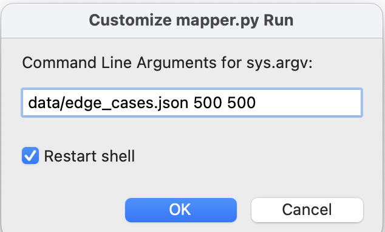
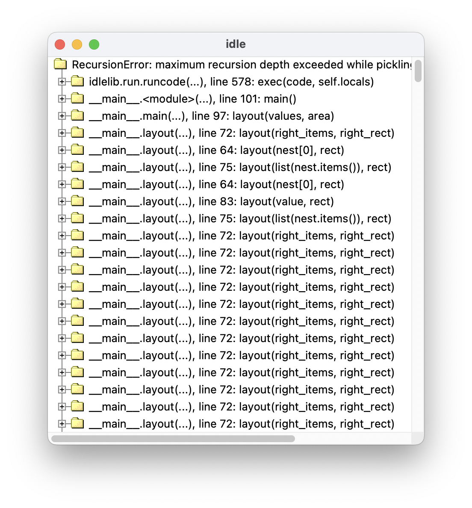
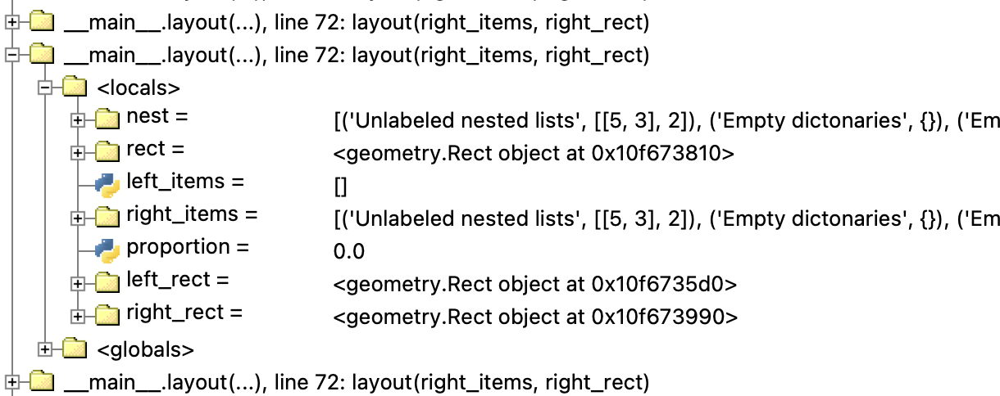

# Robust Input Handling

In professional software development, a good deal of effort is 
expended on handling unusual "edge cases" robustly.
If you have completed the treemap project as described
in the [HOWTO document](HOWTO-Treemap.md), you should be able
to create a wide variety of treemap displays from hierarchical
data represented as JSON files.  But does it work even for unusual
data that fits our definition of a `Nest`?   

`data/edge_cases.json` contains this odd data: 

```json
[ [], {}, 5,
  { "Unexpected values":
    { "Unlabeled nested lists":  [[5, 3], 2 ],
      "Empty dictonaries": {},
      "Empty lists": [],
      "Empty nested lists": [[], []]
  }}]
```

You might reasonably object that nobody would create such strange 
data, and you would almost be right.  Probably nobody would create 
data with empty lists or empty dictionaries _by hand_, but often 
data for visualization is created by other programs.   So let's try it. 

```commandline
python3 mapper.py data/edge_cases.json 500 500
```

Whoops!  You likely got an error message like this one: 

```commandline
Traceback (most recent call last):
  File "your_path/mapper.py", line 101, in <module>
    main()
  File "your_path/mapper.py", line 97, in main
    layout(values, area)
  File "your_path/mapper.py", line 71, in layout
    layout(left_items, left_rect)
  File "your_path/mapper.py", line 71, in layout
    layout(left_items, left_rect)
  File "your_path/mapper.py", line 69, in layout
    proportion = splitter.deep_sum(left_items) / splitter.deep_sum(nest)
                 ~~~~~~~~~~~~~~~~~~~~~~~~~~~~~~^~~~~~~~~~~~~~~~~~~~~~~~~
ZeroDivisionError: division by zero
```

Using the line number in the last part of the traceback (69 in this  
case), we can locate where the division by zero occurred: 

```python
        else:
            left_items, right_items = splitter.bisect(nest)
            proportion = splitter.deep_sum(left_items) / splitter.deep_sum(nest)
            left_rect, right_rect = rect.split(proportion)
            layout(left_items, left_rect)
            layout(right_items, right_rect)
```

At first glance it looks like we will need another special case for
`splitter.deep_sum(nest) == 0`, but zooming out just a little we can 
see a simpler option: 

```python
        elif len(nest) == 0:
            pass
        else:
            left_items, right_items = splitter.bisect(nest)
            proportion = splitter.deep_sum(left_items) / splitter.deep_sum(nest)
            left_rect, right_rect = rect.split(proportion)
            layout(left_items, left_rect)
            layout(right_items, right_rect)
```
An empty `Nest` also has a `deep_sum` of zero ... and any `Nest` 
with a deep sum of 0 can be skipped.  So maybe all we need to do is 
change  `len(nest) == 0` to `splitter.deep_sum(nest) == 0`.  

All better?  Alas, no.  This will eliminate the division by zero, 
but it uncovers another problem: 

```commandline
...
  File "/Users/michal/Dropbox/23F-210/projects/Treemap/splitter.py", line 35, in <genexpr>
    return sum(deep_sum(item) for item in nest)
  File "/Users/michal/Dropbox/23F-210/projects/Treemap/splitter.py", line 35, in deep_sum
    return sum(deep_sum(item) for item in nest)
  File "/Users/michal/Dropbox/23F-210/projects/Treemap/splitter.py", line 35, in <genexpr>
    return sum(deep_sum(item) for item in nest)
  File "/Users/michal/Dropbox/23F-210/projects/Treemap/splitter.py", line 29, in deep_sum
    if isinstance(nest, dict):
RecursionError: maximum recursion depth exceeded while calling a Python object
```

So is this an error in `deep_sum`?  You might think so from the end 
of the error message, but if we look up a little farther in the 
stack trace we find an important clue: 

```commandline
... 
  File "/Users/michal/Dropbox/23F-210/projects/Treemap/mapper.py", line 72, in layout
    layout(right_items, right_rect)
  [Previous line repeated 976 more times]
  File "/Users/michal/Dropbox/23F-210/projects/Treemap/mapper.py", line 68, in layout
    left_items, right_items = splitter.bisect(nest)
...
```

While the program was in `deep_sum` when it finally "blew the stack", 
the line that occurred 976 times indicates a much more likely culprit.  
Our `layout` function is in an infinite recursive loop.  We need to 
find what value is triggering this recursive loop, so that we can find a 
better way to handle it.  While we could probably find it with 
logging, or even by adding print statements, the best tool for this 
job is a debugger. 

_PyCharm_, _VS Code_, and other advanced development environments have 
sophisticated debuggers, but let's see what we can do with the 
simple debugging facilities of IDLE.  (If you are using a more 
full-featured debugger, try recreating the sleuthing 
with that tool.) We'll run the 
program using 
the "Run ... customized" option under the "Run" menu:



A minute or so later, the stack will blow, and we'll see the 
"maximum recursion depth exceeded" error.  At this point we can 
invoke the debugger to inspect the stack of function stack frames. 
Choose "Stack Viewer" under the "Debug" menu. This will give us a 
view in which the recursive call shows up again and again. 



Scroll down a bit to be sure we are in the recursive loop, and use 
the expand (+) button, then "locals", to see what `layout` was 
working on.   (In _PyCharm_ or _VS Code_, use the stack trace 
display to locate the infinite loop, then display local variables.)



Can you see what has gone wrong? Consider the code in `layout` where 
`nest` is split into `left_items` and `right_items`: 

```python
          left_items, right_items = splitter.bisect(nest)
```
Here we see that `right_items` is the same as `nest`, and 
`left_items` is empty.  Bisection has failed! A closer look at the 
list that `splitter.bisect` failed to divide correctly can help us 
understand why: 

```python
[('Unlabeled nested lists', [[5, 3], 2]),
 ('Empty dictonaries', {}), 
 ('Empty lists', []),
 ('Empty nested lists', [[], []])]
```
This is a list with four elements, and with a deep sum of 10, but 
only one element (the first) of its sub-lists has a positive deep 
sum. If we ask `bisect` to divide this list into two parts, one of 
the parts will be empty, and the other part will be the whole list. 

The solution to this problem is to _filter_ the list before deciding 
how to handle it.  In `layout`, once we have determined that the 
`Nest` is a list, we can remove elements whose deep sum is zero 
before we check its length. 

```python
    elif isinstance(nest, list):
        nest = filter_empty(nest)
        if len(nest) == 1:
            etc. 
```

The `filter_empty` function should have this header: 

```python
def filter_empty(li: list[Nest]) -> list[Nest]:
    """Return list with only elements of li whose deep sum is positive

    >>> filter_empty([[], {}, 5])
    [5]
    >>> filter_empty([[[5, 3], 2 ], {}, [], [[], []]])
    [[[5, 3], 2]]
    """
```

As usual, although I have described `filter_empty` as _removing_ 
elements, what it should really do is copy just the remaining 
elements into a fresh list. 

With this change, we should now be able to produce a treemap from 
`edge_cases.json`:

```python
python3 mapper.py data/edge_cases.json 300 300
```


